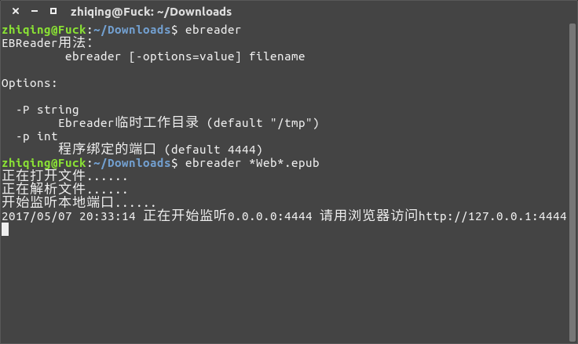
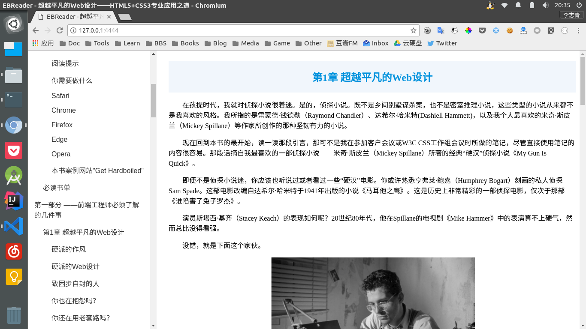

# EBReader
一个让你可以在浏览器中阅读Epub电子书的Linux CLI程序，使用Golang编写


## 安装

有Go语言环境:

```bash
$ cd $GOPATH/src
$ git clone https://github.com/zhiqing-lee/ebreader.git
$ cd ebreader
$ go install
```

没有Go语言环境:

- 下载目录中的ebreader二进制文件并添加到PATH变量

## 使用

- 打开终端，输入`ebreader file.epub`:
```bash
$ ebreader file.epub
正在打开文件......
正在解析文件......
开始监听本地端口......
正在开始监听0.0.0.0:4444 请用浏览器访问http://127.0.0.1:4444
```

- 打开浏览器，访问`http://localhost:4444`

## 选项

```bash
-p          将要绑定的本地端口号(默认为4444)
-P          EBReader的临时工作目录(默认为/tmp)     
```

## 示例

- 运行：



- 浏览:



## 声明

本程序为作者学习Go语言时的练习项目，使用途中出现任何问题均与作者本人无关

